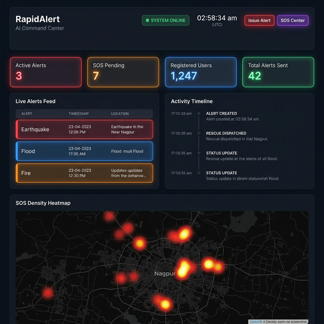
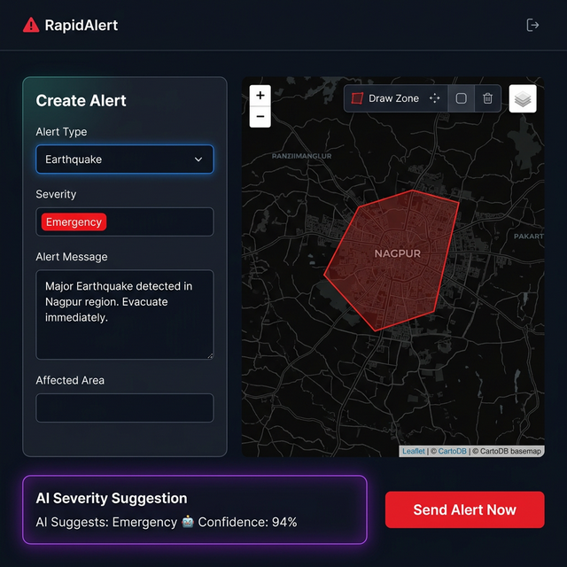
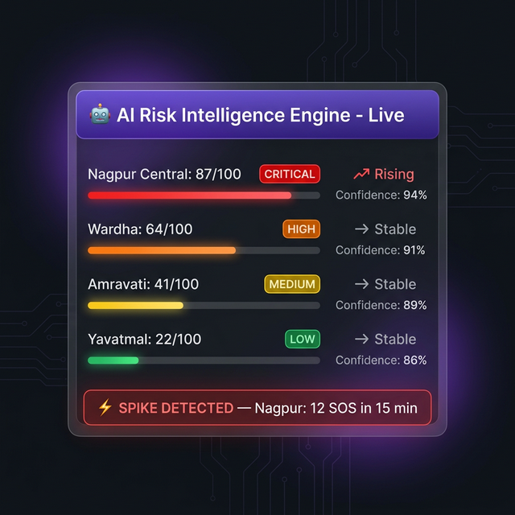
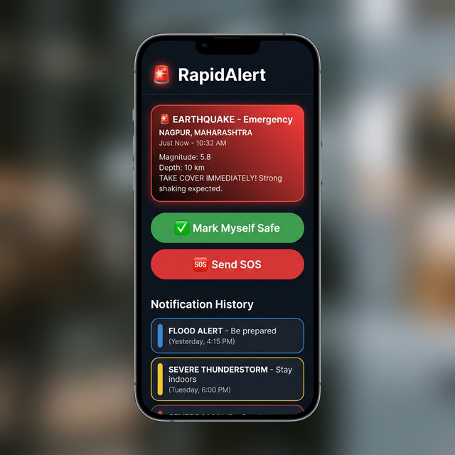

# 🚨 RapidAlert – AI-Powered Disaster Management System

<div align="center">


**A real-time emergency alert and disaster management platform with on-device AI risk intelligence, geo-targeted push notifications, and a full admin control center.**

[🌐 Live Admin Panel](https://smart-community-8fd9a.web.app/rapidalert/) · [📱 Citizen PWA](https://smart-community-8fd9a.web.app/rapidalert-citizen/)

</div>

---

## 📸 Screenshots

<table>
  <tr>
    <td align="center">
      
      <br/><b>🖥️ AI Command Dashboard</b>
      <br/><sub>Live stats, alerts feed, SOS heatmap</sub>
    </td>
    <td align="center">
      
      <br/><b>🗺️ Create Alert + Zone Drawing</b>
      <br/><sub>Draw zones on map, AI severity suggestion</sub>
    </td>
  </tr>
  <tr>
    <td align="center">
      
      <br/><b>🤖 AI Risk Intelligence Engine</b>
      <br/><sub>District risk scores, spike detection, trend analysis</sub>
    </td>
    <td align="center">
      
      <br/><b>📱 Citizen PWA</b>
      <br/><sub>Push alerts, SOS submission, safe reporting</sub>
    </td>
  </tr>
</table>

---

## 📋 Table of Contents

- [Overview](#-overview)
- [Key Features](#-key-features)
- [AI Intelligence Engine](#-ai-intelligence-engine)
- [System Architecture](#-system-architecture)
- [Tech Stack](#-tech-stack)
- [Project Structure](#-project-structure)
- [Setup & Deployment](#-setup--deployment)
- [Security](#-security)
- [Screenshots](#-screenshots)

---

## 🌟 Overview

RapidAlert is a production-grade disaster management platform built for government emergency response teams. It enables:

- **Real-time geo-targeted alerts** to citizens within drawn zones using Firebase Cloud Messaging
- **AI-powered risk scoring** using on-device NLP, spike detection, and predictive modeling — no external AI APIs needed
- **Multi-channel push notifications** via FCM topic broadcasts and token-based delivery
- **SOS emergency system** with live heatmap and response workflow
- **PWA citizen app** with offline support and background notifications

---

## ✨ Key Features

### 🗺️ Admin Control Center
| Feature | Description |
|---------|-------------|
| **AI Command Dashboard** | Real-time stats, live alerts feed, activity timeline, risk heatmap |
| **Alert Creation** | Draw alert zones on map, select type/severity, AI severity suggestions |
| **Active Alert Management** | Cancel broadcasts, view delivery stats, real reach counts |
| **SOS Response Center** | Live heatmap of distress signals, assign responders, track status |
| **Alert History** | Full audit trail with delivery statistics |
| **System Health Monitor** | Real-time Firestore + Cloud Functions status |

### 📱 Citizen PWA
| Feature | Description |
|---------|-------------|
| **OTP Phone Login** | Firebase SMS authentication — no fake accounts |
| **Push Notifications** | Background alerts even when app is closed |
| **Safe Status Reporting** | Citizens mark themselves safe during disasters |
| **SOS Submission** | One-tap emergency distress signal with GPS |
| **Offline Support** | Service Worker caching for offline functionality |
| **Install to Home Screen** | Full PWA with manifest + icons |

---

## 🤖 AI Intelligence Engine

> All AI runs **100% client-side** — no external LLM APIs, no latency, no cost.

### Components

```
📦 ai-engine.js
├── 🧠 NLP Severity Suggester
│   ├── Keyword pattern matching (earthquake, fire, flood, cyclone...)
│   ├── Context-aware scoring with intensity modifiers (major, severe, critical)
│   └── Real-time suggestions as admin types the alert message
│
├── 📊 District Risk Predictor
│   ├── Aggregates events by district from live Firestore data
│   ├── Calculates weighted risk score (0-100)
│   ├── Determines risk level: Low / Medium / High
│   └── Predicts most likely disaster type per district
│
└── ⚡ SOS Spike Detector
    ├── Sliding 15-minute time window
    ├── Detects statistical clustering of SOS requests per district
    └── Triggers spike alert badge on dashboard in real-time
```

### Risk Score Algorithm
```
Risk Score = (alertCount × 25) + (sosCount × 15) + (severityWeight × 20) + distanceBonus
```
- **Confidence** calculated from data density
- **Trend detection**: Rising / Elevated / Stable based on recent velocity

---

## 🏗️ System Architecture

```
┌─────────────────────────────────────────────────────────────┐
│                     CITIZEN PWA                             │
│  Phone OTP Auth → Alert Receive → SOS Submit → Safe Report  │
└──────────────────┬──────────────────────────────────────────┘
                   │  Firestore real-time sync
┌──────────────────▼──────────────────────────────────────────┐
│                  FIREBASE BACKEND                            │
│                                                              │
│  Firestore Collections:                                      │
│  ├── alerts          (active + history)                      │
│  ├── sos_requests    (live emergency feed)                    │
│  ├── users           (registered citizens)                   │
│  ├── safe_reports    (safety confirmations)                   │
│  ├── notification_logs (FCM delivery tracking)               │
│  └── ai_predictions  (cached risk scores)                    │
│                                                              │
│  Cloud Functions (asia-south1):                              │
│  ├── sendAlertNotifications  (FCM geo-targeted dispatch)     │
│  ├── setAdminClaim           (custom admin role)             │
│  └── healthCheck             (system status ping)            │
└──────────────────┬──────────────────────────────────────────┘
                   │  Admin onSnapshot listeners
┌──────────────────▼──────────────────────────────────────────┐
│              ADMIN CONTROL CENTER                            │
│  AI Dashboard → Create Alerts → Manage SOS → View History   │
└─────────────────────────────────────────────────────────────┘
```

---

## 🛠️ Tech Stack

| Layer | Technology |
|-------|-----------|
| **Hosting** | Firebase Hosting (CDN) |
| **Database** | Cloud Firestore (NoSQL real-time) |
| **Auth** | Firebase Authentication (Phone OTP + Email) |
| **Push** | Firebase Cloud Messaging (FCM) |
| **Functions** | Cloud Functions for Firebase (Node.js 18) |
| **Maps** | Leaflet.js + CartoDB dark tiles |
| **Heatmap** | Leaflet.heat plugin |
| **PWA** | Service Worker + Web App Manifest |
| **AI Engine** | Vanilla JS (client-side, no external APIs) |
| **Frontend** | Vanilla HTML + CSS + JavaScript (no framework) |
| **Styling** | Custom CSS with variables, dark theme, glassmorphism |

---

## 📁 Project Structure

```
rapidalert-project/
├── 📁 rapidalert/              # Admin Control Center
│   ├── index.html              # Single-page application shell
│   ├── 📁 css/
│   │   └── style.css           # Full design system (2500+ lines)
│   └── 📁 js/
│       ├── firebase-init.js    # Firebase SDK init (ES Module)
│       ├── app.js              # Core state + Firestore listeners
│       ├── auth.js             # Admin authentication
│       ├── ai-engine.js        # 🤖 AI Risk Intelligence Engine
│       ├── dashboard.js        # Live dashboard renderer
│       ├── create-alert.js     # Alert creation + zone drawing
│       ├── active-alerts.js    # Alert management
│       ├── sos-requests.js     # SOS response center
│       ├── alert-history.js    # Historical audit trail
│       ├── system-status.js    # Health monitoring
│       ├── geocoder.js         # Location search
│       └── ui.js               # Shared UI utilities
│
├── 📁 rapidalert-citizen/      # Citizen PWA
│   ├── index.html              # App shell
│   ├── manifest.json           # PWA manifest
│   ├── sw.js                   # Service Worker (offline + bg push)
│   ├── 📁 css/
│   │   └── app.css             # Citizen app styles
│   └── 📁 js/
│       ├── firebase-citizen.js # Firebase init for citizen
│       ├── app.js              # Citizen app logic
│       └── alarm.js            # Alert sound + notification handler
│
├── 📁 functions/               # Cloud Functions (Node.js)
│   ├── index.js                # Function exports
│   └── 📁 ai/
│       └── severitySuggest.js  # Server-side NLP (reference)
│
├── firebase.json               # Hosting + Functions config
├── firestore.rules             # Security rules
├── firestore.indexes.json      # Composite indexes
├── storage.rules               # Storage security
└── .gitignore                  # Secrets excluded
```

---

## 🚀 Setup & Deployment

### Prerequisites
- Node.js 18+
- Firebase CLI: `npm install -g firebase-tools`
- Firebase project with Blaze plan (for Cloud Functions + FCM)

### 1. Clone & Install
```bash
git clone https://github.com/YOUR_USERNAME/rapidalert.git
cd rapidalert
npm install
cd functions && npm install && cd ..
```

### 2. Configure Firebase
Create `firebase-env.js` in the root (excluded from git):
```javascript
window.RAPIDALERT_CONFIG = {
  apiKey: "YOUR_API_KEY",
  authDomain: "YOUR_PROJECT.firebaseapp.com",
  projectId: "YOUR_PROJECT_ID",
  storageBucket: "YOUR_PROJECT.appspot.com",
  messagingSenderId: "YOUR_SENDER_ID",
  appId: "YOUR_APP_ID",
  vapidKey: "YOUR_VAPID_KEY",
  env: "production"
};
```

### 3. Deploy
```bash
# Full deploy
firebase deploy --project YOUR_PROJECT_ID

# Hosting only
firebase deploy --only hosting --project YOUR_PROJECT_ID

# Functions only
firebase deploy --only functions --project YOUR_PROJECT_ID
```

### 4. Set Admin Role
```bash
# Via Firebase Admin SDK
node scripts/set-admin.js admin@yourdomain.com
```

---

## 🔐 Security

| Layer | Implementation |
|-------|---------------|
| **Admin Auth** | Firebase Email/Password + custom `admin` claim verification |
| **Citizen Auth** | Firebase Phone OTP (prevents anonymous abuse) |
| **Firestore Rules** | Role-based access — admins write alerts, citizens read only their zones |
| **Cloud Functions** | Service account auth, no public unauthenticated endpoints |
| **Secrets** | `firebase-env.js` + `serviceAccountKey.json` excluded from git |
| **HTTPS** | Enforced via Firebase Hosting + HSTS headers |
| **CSP** | X-Content-Type-Options, X-Frame-Options, X-XSS-Protection headers |

---

## 📊 Firestore Data Model

```
alerts/{alertId}
  ├── type: "Earthquake" | "Flood" | "Fire" | "Cyclone" | "Tsunami" | "Other"
  ├── severity: "Info" | "Warning" | "Emergency" | "Evacuate"
  ├── message: string
  ├── area: string
  ├── geoJSON: object (drawn zone polygon)
  ├── active: boolean
  ├── timeSent: timestamp
  ├── reach: number (citizens notified)
  └── creatorUid: string

sos_requests/{sosId}
  ├── name: string
  ├── phone: string
  ├── location: { latitude, longitude }
  ├── area: string
  ├── status: "Pending" | "Responded" | "Resolved"
  └── time: timestamp

users/{userId}
  ├── phone: string
  ├── location: geopoint
  ├── geohash: string (for geo-queries)
  └── fcmToken: string
```

---

## 🎯 AI Features Showcase

> **No external AI APIs were used. All intelligence is computed client-side in real-time.**

1. **NLP Severity Engine** — Analyzes alert message text using keyword patterns and intensity modifiers to suggest appropriate severity levels (Info → Warning → Emergency → Evacuate)

2. **District Risk Predictor** — Continuously processes live Firestore event streams to compute risk scores (0-100) per district, identify likely disaster types, and predict trend direction (Rising / Elevated / Stable)

3. **SOS Spike Detector** — Implements a real-time sliding window algorithm that detects statistical clustering of SOS signals within 15 minutes, triggering spike alerts for emergency coordinators

4. **Geofence Intelligence** — AI-assisted zone targeting: all alerts are geo-coded with Haversine distance + point-in-polygon checks to ensure only citizens within the drawn zone receive notifications

---

## 📄 License

MIT License — Free to use for educational, research, and non-commercial purposes.

---

<div align="center">

Built with ❤️ for disaster preparedness and community safety.

**RapidAlert** — *When every second counts.*

</div>
